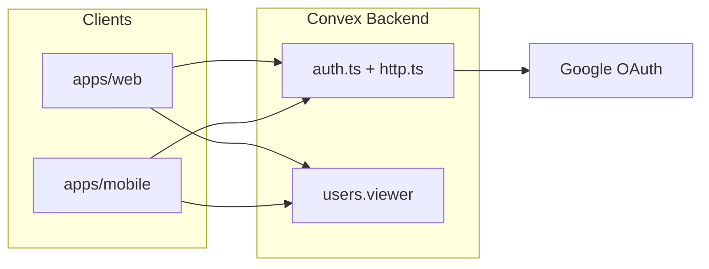

# convex-monorepo

Turborepo monorepo template for full-stack web and mobile apps with a shared Convex backend.

| Workspace | Stack |
|-----------|-------|
| `apps/web` | Next.js 16, React 19, HeroUI v3, Tailwind v4 |
| `apps/mobile` | Expo 56, Expo Router, HeroUI Native, Uniwind |
| `packages/backend` | Convex, `@convex-dev/auth`, Google OAuth |
| `packages/types` | Shared TypeScript interfaces |
| `packages/utils` | Shared utilities (`cn`, `formatDate`, `sleep`) |

Both apps share one Convex deployment, one auth system, and workspace packages — add features once in the backend and consume them from web and mobile.

---

## Prerequisites

Install these before cloning:

| Tool | Version | Notes |
|------|---------|-------|
| [Bun](https://bun.sh) | ≥ 1.x | Package manager for this repo |
| Node.js | ≥ 20 | Required by Expo build tooling |
| Android Studio / Xcode | — | For mobile simulators and dev builds |
| Convex account | — | [convex.dev](https://convex.dev) |
| Google Cloud project | — | OAuth 2.0 credentials for sign-in |

Turbo is installed via root `devDependencies` — no global install needed. Use `bunx expo` instead of a global Expo CLI install.

---

## Quick Start

### 1. Clone and install

```bash
git clone <repo-url>
cd convex-monorepo
bun install
```

`bunfig.toml` sets `linker = "hoisted"` for Bun workspaces. Do not change this or switch to npm/pnpm.

### 2. Create environment files

Copy the example env file at the repo root:

```bash
cp .env.example .env.local
```

Create app-level env files (values filled in after Convex setup):

```bash
cp .env.example apps/web/.env.local
cp .env.example apps/mobile/.env.local
```

You only need `NEXT_PUBLIC_CONVEX_URL` in `apps/web/.env.local` and `EXPO_PUBLIC_CONVEX_URL` in `apps/mobile/.env.local` — see [Environment Variables](#environment-variables).

### 3. Start Convex and link your deployment

From the repo root:

```bash
bun run convex:dev
```

This will:

1. Prompt you to log in (`bunx convex login` if needed)
2. Create or link a dev deployment
3. Write `CONVEX_DEPLOYMENT`, `CONVEX_URL`, and related values into root `.env.local`
4. Watch `packages/backend/convex/` for changes

The Convex CLI reads backend code from `packages/backend/convex/` (configured in `convex.json`), not from the root `convex/` folder. The root `convex/` directory only holds generated stubs and AI guidelines — do not edit it.

Keep this terminal running while developing.

### 4. Configure Google OAuth

#### Google Cloud Console

1. Open [Google Cloud Console](https://console.cloud.google.com/) → APIs & Services → Credentials
2. Create an **OAuth 2.0 Client ID** (Web application)
3. Set **Authorized JavaScript origins**: `http://localhost:3000`
4. Set **Authorized redirect URI**:

   ```
   https://<your-deployment>.convex.site/api/auth/callback/google
   ```

   Replace `<your-deployment>` with your Convex deployment name (e.g. `kindred-quail-638` from `CONVEX_URL`).

5. Copy the **Client ID** and **Client Secret**

#### Convex environment variables

Set auth secrets in Convex (not in `.env.local`):

```bash
bunx convex env set SITE_URL http://localhost:3000
bunx convex env set AUTH_GOOGLE_ID <your-client-id>
bunx convex env set AUTH_GOOGLE_SECRET <your-client-secret>
```

These are read at runtime by `packages/backend/convex/auth.ts`.

### 5. Fill in client env vars

After `bun run convex:dev`, copy your Convex URL into all env files:

**Root `.env.local`** (most values are auto-filled by Convex CLI):

```env
CONVEX_DEPLOYMENT=dev:xxxxx
CONVEX_URL=https://xxxxx.convex.cloud
CONVEX_SITE_URL=https://xxxxx.convex.site
NEXT_PUBLIC_CONVEX_URL=https://xxxxx.convex.cloud
EXPO_PUBLIC_CONVEX_URL=https://xxxxx.convex.cloud
NEXT_PUBLIC_APP_URL=http://localhost:3000
```

**`apps/web/.env.local`:**

```env
NEXT_PUBLIC_CONVEX_URL=https://xxxxx.convex.cloud
```

**`apps/mobile/.env.local`:**

```env
EXPO_PUBLIC_CONVEX_URL=https://xxxxx.convex.cloud
```

### 6. Run the apps

**Terminal 1** — Convex (if not already running):

```bash
bun run convex:dev
```

**Terminal 2** — Web + mobile via Turbo:

```bash
bun run dev
```

Or run individually:

```bash
# Web → http://localhost:3000
cd apps/web && bun run dev

# Mobile → Expo dev server
cd apps/mobile && bunx expo start
```

---

## Environment Variables

| Variable | Where to set | Used by |
|----------|--------------|---------|
| `CONVEX_DEPLOYMENT` | Root `.env.local` | Convex CLI |
| `CONVEX_URL` | Root `.env.local` | Convex CLI |
| `CONVEX_SITE_URL` | Root `.env.local` | Auth callbacks |
| `NEXT_PUBLIC_CONVEX_URL` | Root + `apps/web/.env.local` | Next.js client |
| `EXPO_PUBLIC_CONVEX_URL` | Root + `apps/mobile/.env.local` | Expo client |
| `NEXT_PUBLIC_APP_URL` | Root `.env.local` | Web app URL |
| `SITE_URL` | Convex (`bunx convex env set`) | Auth redirects |
| `AUTH_GOOGLE_ID` | Convex (`bunx convex env set`) | Google OAuth |
| `AUTH_GOOGLE_SECRET` | Convex (`bunx convex env set`) | Google OAuth |

Reference template: [.env.example](.env.example)

---

## Mobile: Dev Build Required for Google Sign-In

Mobile Google OAuth uses `expo-web-browser` with the custom URL scheme `heroui-native-app://` (defined in `apps/mobile/app.json`).

**Expo Go does not support custom URL schemes** — you need a development build.

### Local dev build

```bash
cd apps/mobile
bunx expo run:android   # Android emulator or device
bunx expo run:ios       # iOS simulator or device
```

### EAS development build

```bash
cd apps/mobile
bunx eas build --profile development --platform android
# or --platform ios
```

Allowed OAuth redirect targets are configured in `packages/backend/convex/auth.ts`:

- `SITE_URL` (e.g. `http://localhost:3000`)
- `heroui-native-app://` (mobile custom scheme)
- `exp://` (Expo dev client)

If you change the app scheme in `app.json`, update `MOBILE_SCHEME` in `auth.ts` to match.

---

## Project Structure

```
convex-monorepo/
├── apps/
│   ├── web/                    # Next.js 16 web app
│   │   ├── app/                # App Router routes
│   │   ├── components/         # UI components
│   │   └── src/lib/convex.tsx  # ConvexAuthProvider
│   └── mobile/                 # Expo 56 mobile app
│       ├── src/app/            # Expo Router routes
│       ├── src/components/
│       └── lib/convex.tsx      # ConvexAuthProvider + SecureStore
├── packages/
│   ├── backend/
│   │   └── convex/             # Shared Convex backend (edit here)
│   │       ├── auth.ts         # Google OAuth + redirect rules
│   │       ├── auth.config.ts
│   │       ├── schema.ts
│   │       ├── users.ts
│   │       └── http.ts
│   ├── types/                  # @repo/types
│   └── utils/                  # @repo/utils
├── convex/                     # Generated stubs only — do NOT edit
├── convex.json                 # functions → packages/backend/convex
├── turbo.json
├── bunfig.toml                 # linker = "hoisted" (required)
└── .env.example
```

---

## Auth Architecture

Both apps use **Convex Auth** (`@convex-dev/auth`) with Google as the OAuth provider.



| Layer | Location | Role |
|-------|----------|------|
| Backend auth | `packages/backend/convex/auth.ts` | Google provider, redirect validation |
| JWT config | `packages/backend/convex/auth.config.ts` | Issuer = `CONVEX_SITE_URL` |
| HTTP routes | `packages/backend/convex/http.ts` | `auth.addHttpRoutes` |
| Web provider | `apps/web/src/lib/convex.tsx` | `ConvexAuthProvider` |
| Mobile provider | `apps/mobile/lib/convex.tsx` | `ConvexAuthProvider` + `expo-secure-store` |
| Web route guard | `apps/web/components/auth/auth-gate.tsx` | Redirects to `/sign-in` |
| Mobile route guard | `apps/mobile/src/components/auth-gate.tsx` | Redirects to `/(auth)/sign-in` |
| Profile data | `packages/backend/convex/users.ts` | `viewer` query, `updateProfile` mutation |

**Routes:**

- Web: `/sign-in`, `/sign-up` (auth) · `/farmer/*`, `/buyer/*` (role-based after onboarding)
- Mobile: `/(auth)/sign-in`, `/(auth)/sign-up` (auth) · `/(farmer)/*`, `/(buyer)/*` (role-based)

---

## Adding a New Feature

| What | Where |
|------|-------|
| Convex queries/mutations | `packages/backend/convex/` |
| Database schema | `packages/backend/convex/schema.ts` |
| Shared types | `packages/types/src/index.ts` |
| Shared utilities | `packages/utils/src/index.ts` |
| Web-only UI | `apps/web/components/` |
| Mobile-only UI | `apps/mobile/src/components/` |

Import the generated API in any app:

```typescript
import { api } from "@repo/backend/convex/_generated/api";
import { useQuery, useMutation } from "convex/react";

const user = useQuery(api.users.viewer);
```

After schema changes, keep `bun run convex:dev` running — it pushes updates automatically.

---

## Scripts

| Command | Description |
|---------|-------------|
| `bun run dev` | Start web + mobile via Turbo |
| `bun run convex:dev` | Start Convex dev server and file watcher |
| `bun run build` | Build all apps |
| `bun run lint` | Lint all packages |
| `bun run typecheck` | Type-check all packages |

---

## Troubleshooting

### `bunx convex dev` fails or won't connect

```bash
bunx convex login
bun run convex:dev
```

### Google sign-in fails on web

- Confirm redirect URI in Google Cloud matches `https://<deployment>.convex.site/api/auth/callback/google`
- Confirm `AUTH_GOOGLE_ID` and `AUTH_GOOGLE_SECRET` are set in Convex: `bunx convex env list`
- Confirm `SITE_URL` is `http://localhost:3000` for local dev

### Google sign-in fails on mobile

- Use a **dev build**, not Expo Go
- Confirm `EXPO_PUBLIC_CONVEX_URL` is set in `apps/mobile/.env.local`
- Confirm app scheme in `app.json` matches `MOBILE_SCHEME` in `auth.ts` (`heroui-native-app`)

### TypeScript path alias errors

Root `tsconfig.base.json` defines `@repo/types` and `@repo/utils`. Each app and package extends it via its own `tsconfig.json`. Run `bun run typecheck` from the root to surface issues.

### `bun install` fails

Do not switch to npm or pnpm. This repo requires Bun with `linker = "hoisted"` in `bunfig.toml`.

### Changes to Convex functions not appearing

Ensure `bun run convex:dev` is running and watching `packages/backend/convex/`. The root `convex/` folder is not the source of backend code.

---

## New Project From This Template

When cloning this repo to start a new project:

1. Clone and `bun install`
2. Run `bun run convex:dev` to create a **new** Convex deployment (do not reuse the template's deployment)
3. Set up Google OAuth with your new deployment's callback URL
4. Update app names in `apps/web/config/site.ts` and `apps/mobile/src/constants/app-config.ts`
5. Optionally change the mobile URL scheme in `apps/mobile/app.json` and `packages/backend/convex/auth.ts`
6. Commit only `.env.example` — never commit `.env.local` files

---

## Learn More

- [Convex Docs](https://docs.convex.dev)
- [Convex Auth](https://labs.convex.dev/auth)
- [Turborepo](https://turbo.build/repo/docs)
- [Expo Router](https://docs.expo.dev/router/introduction/)
- [HeroUI](https://heroui.com) · [HeroUI Native](https://github.com/heroui-inc/heroui-native)
